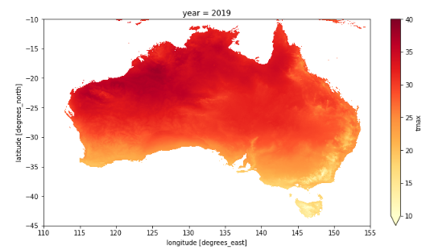
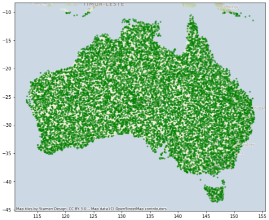
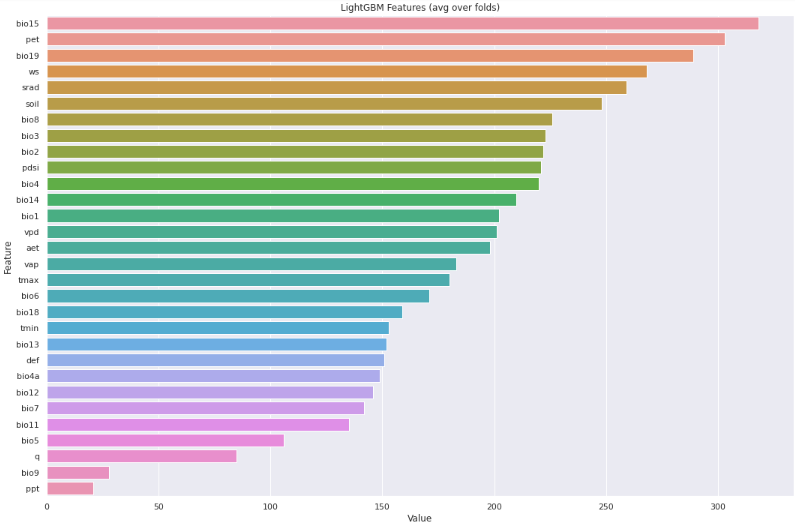
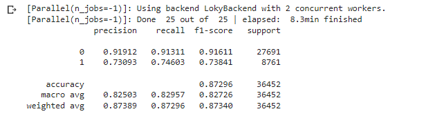

# 2022 Biodiversity Challenge Finalist
This repo contains my finalist resolutions of the data challenge proposed by EY.

---

## Notebooks:

### [MODEL BUILDING NOTEBOOK ](notebooks/MODEL_BUILDING_NOTEBOOK.ipynb) 

### [VALIDATION NOTEBOOK](notebooks/VALIDATION_NOTEBOOK.ipynb) 

### Introductions:
The planet has been going through enormous challenges. It's been facing problems of population increase, loss of ecosystems and biodiversity, soil degradation, and global pollution. But as these problems grow, tools based on artificial intelligence are being developed to delay the total depletion of these resources and counteract their effects. 

In recent years, the amount of environmental data collected by geospatial information systems and the applied statistical techniques have undergone a great development, which has allowed the expansion of new and better tools for research in biology.

EY and Microsoft proposed that we find a predictive model that allows us to predict the geographical distribution of frog species on the earth's surface to build a better world. It is the aim of this work. We wanted to create the best model possible that allows us to understand environmental health using frogs as indicators.

### Problem Statement:
The Australian Meteorological Agency revealed that 2019 was the hottest and driest year in the country's history. As a result of climate change, experts have been warning for years that Australia will increasingly suffer from extreme heat and forest fires. 

The objective of this challenge was to use the presence of frog species as biomarkers to understand the environmental health of a given region. We want to predict the occurrence of the Littoral Fallax frog species in the Australian continent using environmental information extracted from Microsoft Terraclime.
In this work, we create a model to predict the distribution of the frog species (Littoral Fallax) in the Australian continent using machine learning. We build our model using climate information available in the Microsoft Terraclime database.

### Methodology:
Preparation of predictor variables: It was relevant to select a correct year interval for the frog observations. 
Generation of new features: We wanted to find new explanatory variables from the climatological variables extracted from Microsoft's Terraclime that will allow us to explain the relationship between the seasons and the observations of the frogs.
There is a strong relationship between seasons and the presence of frogs. We believe there is a strong relationship between the probability of occurrence and the year's season.
Creation of new Pseudo-absence points: We created new data to identify the non-presence of frogs in different regions.
Select and optimize the model: To improve our model we used advanced techniques of hyperparameter tuning.
What is innovative and unique about your approach?
I worked hard trying to find new climatological variables because we want to explain the effect of seasonality and the occurrence of frogs.

#### Target dataset: 

●	We used observations of frog species between the years 2015 and 2020 within the Australian territory.

●	We used observations of the species Crinia Signifera, Crinia Glauerti, Ranoidea Australis, and Austrochaperina Pluvialis as pseudo absence observations (78207 observations).

●	We used a total of 29,224 observations of Littoral Fallax frogs.

●	We generated 14,215 new observations as pseudo absence across Australia and added them to the dataset.

#### Predictor dataset:

●	We only used climatological information obtained from Microsoft Terraclime between 2015 and 2020 within the Australian territory.

●	We selected the year with the best accuracy result obtained to train our model.

●	We selected 13 variables from the original dataset from Microsoft Terraclime.

●	We created 17 new variables to try to predict the effect of seasonality.

●	We removed all records with missing values.

●	We used Spearman's correlation to evaluate the correlation between the predictor variables and the target variable.

●	We verified the importance of each feature through the LGBMClassifier algorithm.

●	We transformed the variables using the yeo-johnson method since it was the one that produced the best result.

#### Describe your approach to model validation:

We split the dataset into 30% for the training data set and 70% for the test data set.
We used Repeated k-Fold Cross-Validation with a split of 5 and a repetition of 5. To maintain the class's balance, we used the RepeatedStratifiedKFold class from sklearn.
List the training methods you use:

●	We decided to select the LGBMClassifier algorithm since it is fast and can achieve good accuracy when it’s correctly tuned. We evaluated the following classification algorithms:

○	RandomForestClassifier.

○	ExtraTreesClassifier.

○	GradientBoostingClassifier.

○	BaggingClassifier.

○	AdaBoostClassifier.

○	XGBClassifier.

○	XGBRFClassifier.

○	DecisionTreeClassifier.

●	We used the Repeated k-Fold Cross-Validation technique and f1 score to select the best model.

●	We tried SMOTE to balance the classes, but we can not improve the model.

●	We calibrated the model using CalibratedClassifierCV. 

●	We used advanced techniques of hyperparameter tuning. We used the Optuna framework.

●	We achieved an f1 score of 87.3% on the training set.

### Results & Analysis:
Describe your highest-performing features:

The three features that had the best performance were bio15, pet and bio19.

●	Bio15: It's the standard deviation of the monthly precipitation divided by the precipitation's mean. 

●	Pet:  is defined as the amount of evaporation that would occur if a sufficient water source were available.

●	Bio19: Corresponds to the precipitation of the driest months of the year, between July and September.

We identified a strong relationship between the variables related to precipitation and the target variable.
Describe the evolution of your approach for selecting the best model:

1) Select the two best models with the best accuracy in the training data set. We selected the model with the best performance in different time windows.
2) Apply different transformations to the features and stay with the one that performs best.
3) Apply different techniques to try to balance the dataset. 
4) Calibrate the selected model to improve the odds.
5) Finding the set of best parameters (Tuning hyperparameter) using different techniques. 
6) Evaluate the model with different time windows of climate data on the test data set.

#### Results of the best model in testing data set:
The following performance metrics were obtained after applying the LGBMClassifier models to the final dataset.
We achieved The best f1 weighted score (0.8725) in the test data set using the 2019 weather information. LGBMClassifier achieves 0.91611 and 0.73841 in class 0, 1, respectively. 

The reason why the models cannot predict class 1 well is that class 1 has less train examples than class 0. As proof, class 0 has 27691 support, by contrast, class 1 with 8761 supports. We tried to balance the dataset using under and oversampling, but it had worse results than the original models. We decided to keep the unbalanced dataset. 
Prediction accuracy score on the unseen data:

My best score obtained in the unseen data was 0.77

Describe the most important breakthrough that helped you to improve your score:

There are two aspects that were very important to improving the scores:

1)	Having found new features that represent the effect of seasonality in the presence of frogs.
2)	Finding the correct balance of pseudo absence data was essential to improve the score.
3)	Finding a correct tuning of hyperparameters.
What was the hardest thing about solving this problem?

I think it was trying to correct the effect of sampling bias in species distribution modeling. For this, we add more pseudo absence observations.

## Autor  ✒️
:octocat: Pedro Miguel Pérez

## Contacto 📌
Contacto por mail _pedromperezc@gmail.com_ o por mi linkedin personal [LinkedIn](https://www.linkedin.com/in/pedromiguelperez/)